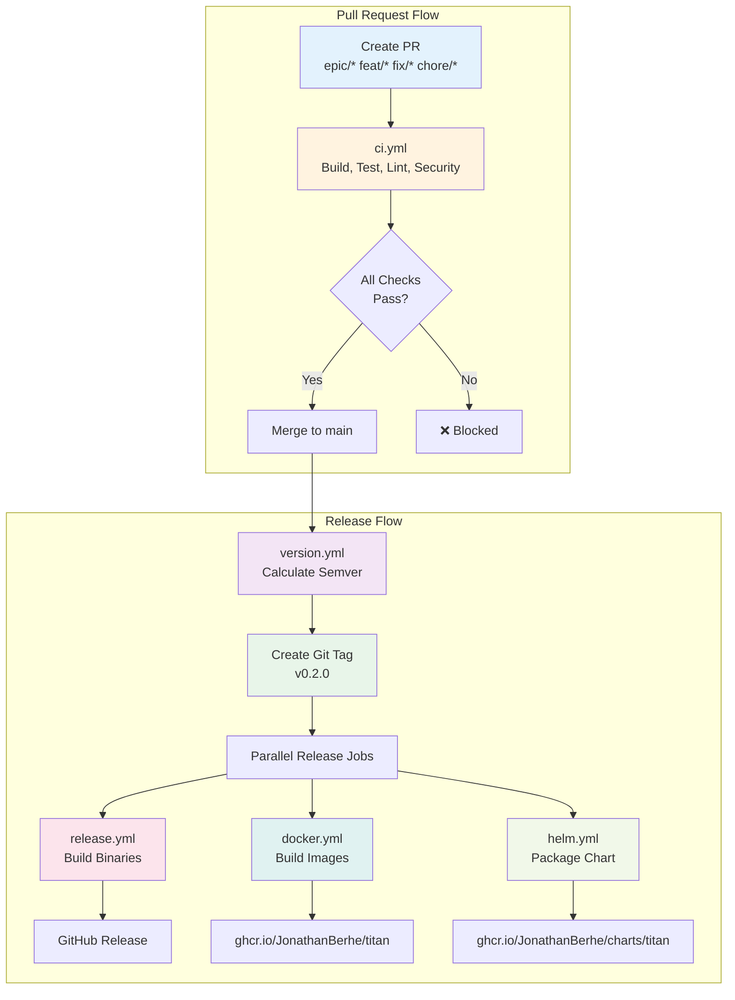

# CI/CD Pipeline Documentation

Complete guide to Titan's automated CI/CD pipeline with semantic versioning, multi-architecture builds, and automated releases.

## 🏗️ Architecture Overview



## 📋 Workflow Files

| Workflow | Trigger | Purpose |
|----------|---------|---------|
| `ci.yml` | Pull Request | Build, test, lint, security scan |
| `version.yml` | Push to main | Calculate semver, create tag |
| `release.yml` | Tag created (v*) | Build multi-arch binaries |
| `docker.yml` | Tag created (v*) | Build & push Docker images |
| `helm.yml` | Tag created (v*) | Package & publish Helm chart |

## 🌿 Branch Naming Convention

Branch names **must** start with one of these prefixes:

| Prefix | Version Bump | Example | Use Case |
|--------|--------------|---------|----------|
| `epic/` | **MAJOR** (v0.x.x → v1.0.0) | `epic/new-architecture` | Breaking changes, major rewrites |
| `feat/` | **MINOR** (v0.1.x → v0.2.0) | `feat/connection-pooling` | New features, backward compatible |
| `fix/` | **PATCH** (v0.1.0 → v0.1.1) | `fix/memory-leak` | Bug fixes, security patches |
| `chore/` | **No bump** | `chore/update-deps` | Dependencies, refactoring, docs |

### Examples

```bash
# Creating a new feature (minor version bump)
git checkout -b feat/http2-support main
# ... make changes ...
git push origin feat/http2-support
# Create PR → After merge → v0.1.0 → v0.2.0

# Creating a bug fix (patch version bump)
git checkout -b fix/segfault-in-parser main
# ... make changes ...
git push origin fix/segfault-in-parser
# Create PR → After merge → v0.2.0 → v0.2.1

# Breaking change (major version bump)
git checkout -b epic/complete-rewrite main
# ... make changes ...
git push origin epic/complete-rewrite
# Create PR → After merge → v0.2.1 → v1.0.0

# Maintenance work (no version bump)
git checkout -b chore/update-cmake main
# ... make changes ...
git push origin chore/update-cmake
# Create PR → After merge → v1.0.0 (unchanged)
```

## 🔄 Complete Release Flow

### 1️⃣ Pull Request (ci.yml)

**Triggers:** PR opened, synchronized, or reopened against `main`

**Jobs:**

1. **validate-branch** - Ensures branch name starts with `epic/`, `feat/`, `fix/`, or `chore/`
2. **build-test** - Builds on x86_64 and ARM64, runs unit tests
3. **lint** - Checks code formatting (clang-format), runs clang-tidy
4. **security** - CodeQL analysis, Trivy filesystem scan
5. **integration-test** - Runs Python integration tests (if available)
6. **ci-success** - Summary job (required status check)

**Required Status Checks:**
Set "All CI Checks Passed" as required in branch protection rules.

### 2️⃣ Merge to Main (version.yml)

**Triggers:** Push to `main` branch (after PR merge)

**Steps:**

1. **Get latest tag** - Fetches current version (e.g., `v0.1.5`)
2. **Determine version bump** - Parses merged branch name from commit message
   - `epic/*` → MAJOR bump
   - `feat/*` → MINOR bump
   - `fix/*` → PATCH bump
   - `chore/*` → Skip (no release)
3. **Calculate new version** - Bumps semver (e.g., `v0.1.5` → `v0.2.0`)
4. **Create annotated tag** - Creates `v0.2.0` tag with metadata
5. **Push tag** - Triggers release workflows
6. **Create GitHub Release** - Draft release with changelog

**Skip Releases:**
Add `[skip ci]` or `[no version]` to commit message to skip versioning.

### 3️⃣ Binary Release (release.yml)

**Triggers:** Tag created matching `v*` pattern

**Build Matrix:**

| Variant | Architecture | Optimizations | Target |
|---------|--------------|---------------|--------|
| `generic` | x86_64 | SSE4.2 | All x86-64 CPUs (2009+) |
| `haswell` | x86_64 | AVX2, FMA | AWS EC2, GCP (2013+) |
| `skylake` | x86_64 | AVX2, AVX512 | Modern servers (2015+) |
| `zen3` | x86_64 | AVX2, optimized for AMD | AMD EPYC Milan, Ryzen 5000 |
| `generic-arm` | ARM64 | NEON | All ARM64 CPUs (ARMv8+) |
| `neoverse-n1` | ARM64 | Optimized for N1 | AWS Graviton 2, Azure Cobalt |
| `neoverse-v1` | ARM64 | SVE support | AWS Graviton 3/4 |
| `apple-m1` | ARM64 | Apple Silicon opts | M1/M2/M3 Macs |

**Artifacts:**
- Binary tarball: `titan-{variant}-linux-{arch}.tar.gz`
- SHA256 checksum: `titan-{variant}-linux-{arch}.tar.gz.sha256`
- Attached to GitHub Release

### 4️⃣ Docker Image (docker.yml)

**Triggers:** Tag created matching `v*` pattern

**Registry:** GitHub Container Registry (ghcr.io)

**Tags Created:**
```
ghcr.io/JonathanBerhe/titan:v0.2.0       # Exact version
ghcr.io/JonathanBerhe/titan:0.2           # Major.minor
ghcr.io/JonathanBerhe/titan:0             # Major only
ghcr.io/JonathanBerhe/titan:latest        # Latest stable
ghcr.io/JonathanBerhe/titan:sha-abc123f   # Commit SHA
```

**Features:**
- Multi-architecture build (linux/amd64, linux/arm64)
- Buildx caching (GitHub Actions cache)
- SBOM generation (SPDX format)
- Trivy security scan
- Automatic signing with cosign (optional)

**Usage:**
```bash
# Pull latest
docker pull ghcr.io/JonathanBerhe/titan:latest

# Run locally
docker run -p 8080:8080 \
  -v $(pwd)/config.json:/etc/titan/config.json \
  ghcr.io/JonathanBerhe/titan:v0.2.0 \
  --config /etc/titan/config.json
```

### 5️⃣ Helm Chart (helm.yml)

**Triggers:** Tag created matching `v*` pattern

**Registry:** GitHub Container Registry (OCI format)

**Steps:**
1. Extract version from tag (`v0.2.0` → `0.2.0`)
2. Update `Chart.yaml` version and appVersion
3. Update `values.yaml` image tag
4. Lint chart
5. Package chart (`titan-0.2.0.tgz`)
6. Push to GHCR as OCI artifact

**Chart Location:**
```
oci://ghcr.io/JonathanBerhe/charts/titan:0.2.0
```

**Usage:**
```bash
# Login to GHCR (one-time)
echo $GITHUB_TOKEN | helm registry login ghcr.io -u USERNAME --password-stdin

# Install chart
helm install titan oci://ghcr.io/JonathanBerhe/charts/titan \
  --version 0.2.0 \
  --namespace titan \
  --create-namespace

# Upgrade
helm upgrade --install titan oci://ghcr.io/JonathanBerhe/charts/titan \
  --version 0.2.0 \
  --namespace titan \
  --values custom-values.yaml
```

## 🔒 Branch Protection Rules

Configure in GitHub Settings → Branches → Branch protection rules:

**Branch:** `main`

**Rules:**
- ✅ Require pull request before merging
- ✅ Require approvals: 1
- ✅ Require status checks to pass before merging
  - Required checks:
    - `All CI Checks Passed` (from ci.yml)
- ✅ Require conversation resolution before merging
- ✅ Do not allow bypassing the above settings
- ❌ Allow force pushes: disabled
- ❌ Allow deletions: disabled

## 🚀 Quick Start Guide

### For Contributors

1. **Create a feature branch:**
   ```bash
   git checkout -b feat/my-feature main
   ```

2. **Make changes and commit:**
   ```bash
   git add .
   git commit -m "Add awesome new feature"
   git push origin feat/my-feature
   ```

3. **Create Pull Request:**
   - PR checks will run automatically
   - Fix any failing checks
   - Wait for review approval

4. **Merge PR:**
   - Once approved and checks pass, merge to main
   - GitHub will automatically:
     - Calculate version bump (feat/ → minor)
     - Create tag (e.g., v0.2.0)
     - Build binaries, Docker image, Helm chart
     - Publish to registries

### For Release Managers

**Manual Tag Creation (Emergency):**
```bash
# If automatic versioning fails, manually create tag
git tag -a v0.2.0 -m "Emergency release v0.2.0"
git push origin v0.2.0
# Triggers release/docker/helm workflows
```

**Hotfix Process:**
```bash
# Create hotfix branch from latest tag
git checkout -b fix/critical-bug v0.2.0
# ... fix bug ...
git commit -m "Fix critical security issue"
git push origin fix/critical-bug
# Create PR against main, merge → v0.2.1 released
```

## 📊 Monitoring Releases

### GitHub Actions Dashboard
https://github.com/titan-gateway/titan/actions

### Release Status
```bash
# Check latest release
gh release view --web

# List all releases
gh release list

# Download specific artifact
gh release download v0.2.0 --pattern 'titan-generic-linux-x86_64.tar.gz'
```

### Container Registry
```bash
# List Docker image tags
gh api /user/packages/container/titan/versions | jq '.[].metadata.container.tags'

# List Helm chart versions
gh api /user/packages/container/charts%2Ftitan/versions | jq '.[].metadata.container.tags'
```

## 🛠️ Troubleshooting

### Branch name validation fails
**Error:** "Branch name must start with: epic/, feat/, fix/, or chore/"

**Solution:** Rename your branch:
```bash
git branch -m my-feature feat/my-feature
git push origin -u feat/my-feature
```

### Version not bumped after merge
**Causes:**
1. Commit message contains `[skip ci]` or `[no version]`
2. Branch was `chore/*` (intentionally skipped)
3. Merge commit message doesn't contain branch name

**Solution:** Manually create tag:
```bash
git tag v0.2.0
git push origin v0.2.0
```

### Docker image build fails
**Check:**
1. Does `Dockerfile.production` exist?
2. Are multi-platform builds enabled in repo settings?
3. Check workflow logs for build errors

### Helm chart not found
**Verify:**
```bash
# Check if chart was published
helm show chart oci://ghcr.io/JonathanBerhe/charts/titan --version 0.2.0

# Check GHCR permissions
gh auth status
```

## 📚 Additional Resources

- [Semantic Versioning 2.0.0](https://semver.org/)
- [GitHub Actions Documentation](https://docs.github.com/en/actions)
- [GitHub Container Registry](https://docs.github.com/en/packages/working-with-a-github-packages-registry/working-with-the-container-registry)
- [Helm OCI Registries](https://helm.sh/docs/topics/registries/)

## 🔐 Required Secrets

| Secret | Required For | How to Create |
|--------|--------------|---------------|
| `GITHUB_TOKEN` | All workflows | Auto-created by GitHub Actions |

**Note:** `GITHUB_TOKEN` is automatically provided by GitHub Actions and has sufficient permissions for:
- Creating tags and releases
- Pushing to GHCR (ghcr.io)
- Publishing Helm charts

**Optional Secrets:**
- `DOCKERHUB_TOKEN` - If also publishing to Docker Hub
- `COSIGN_KEY` - For signing container images

---

**Last Updated:** 2025-11-26
**Maintainers:** Titan Team
